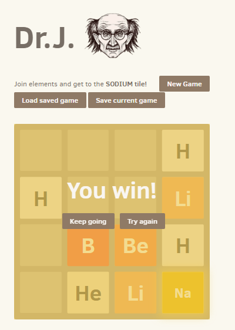

# Dr.J 

A small clone of [2048](http://gabrielecirulli.github.io/2048/) based on [1024](https://play.google.com/store/apps/details?id=com.veewo.a1024) and  [Saming's 2048](http://saming.fr/p/2048/) (both clones).

Made just for fun. [Play it here!](https://hjondi.github.io/Dr.J/)

### Screenshot

  

## Contributing
Changes and improvements are more than welcome! Feel free to fork and open a pull request. Please make your changes in a specific branch and request to pull into `master`! If you can, please make sure the game fully works before sending the PR, as that will help speed up the process.

## License
Dr.J is licensed under the [MIT license.](https://github.com/hjondi/K.O/blob/gh-pages/LICENSE.txt)
